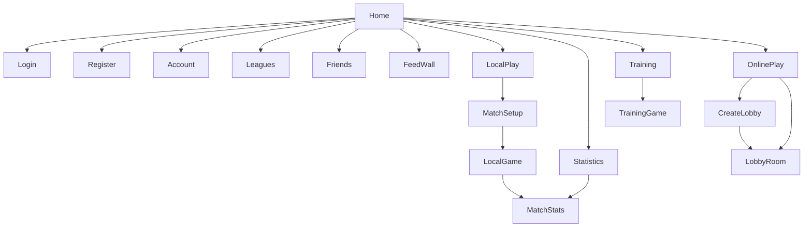

# DartScore – Ekrani i UI komponente

Ovaj dokument nadopunjuje [ARCHITECTURE.md](ARCHITECTURE.md) detaljnim katalogom svakog Compose ekrana i dijeljene komponente u `ui/` sloju, te punom navigacijskom shemom iz `MainActivity.kt`. Za opći pregled projekta pogledajte [README.md](../README.md).

## 1. Navigacija (`MainActivity.kt`)

### `AppScreen` (sealed class)

```kotlin
private sealed class AppScreen {
    data object Home : AppScreen()
    data object Login : AppScreen()
    data object Register : AppScreen()
    data object Account : AppScreen()
    data object Statistics : AppScreen()
    data object Leagues : AppScreen()
    data object Friends : AppScreen()
    data object FeedWall : AppScreen()
    data object LocalPlay : AppScreen()
    data object MatchSetup : AppScreen()
    data class LocalGame(val settings: MatchSettings) : AppScreen()
    data object OnlinePlay : AppScreen()
    data object CreateLobby : AppScreen()
    data class LobbyRoom(val lobbyId: String) : AppScreen()
    data object Training : AppScreen()
    data class TrainingGame(val mode: TrainingMode) : AppScreen()
    data class MatchStats(val detail: MatchStatsDetail, val fromHistory: Boolean = false) : AppScreen()
}
```

`var currentScreen by remember { mutableStateOf<AppScreen>(AppScreen.Home) }` drži trenutno stanje; `when (val screen = currentScreen)` dispečira na odgovarajući Composable.

### Tablica dispečiranja ekrana

| `AppScreen` | Composable | Ključni navigacijski callback-ovi |
|---|---|---|
| `Home` | `HomeScreen` | `onNavigateToLogin/Register/Account/LocalPlay/OnlinePlay/Training/Statistics/Leagues/Friends/FeedWall`, `onOpenMatchStats` |
| `Login` | `LoginScreen` | `onNavigateToRegister`, `onNavigateBack`, `onAuthSuccess` |
| `Register` | `RegisterScreen` | `onNavigateToLogin`, `onNavigateBack`, `onAuthSuccess` |
| `Account` | `AccountScreen` | `onNavigateBack`, `onNavigateToLogin`, `onNavigateToRegister` |
| `Statistics` | `StatisticsScreen` | `onNavigateBack`, `onNavigateToLogin`, `onOpenMatch` |
| `Leagues` | `LeaguesScreen` | `onNavigateBack` |
| `Friends` | `FriendsScreen` | `onNavigateBack`, `onNavigateToLogin` |
| `FeedWall` | `FeedWallScreen` | `onNavigateBack`, `onNavigateToLogin` |
| `LocalPlay` | `LocalPlayScreen` | `onNavigateBack`, `onNavigateToMatchSetup` |
| `MatchSetup` | `MatchSetupScreen` | `onNavigateBack`, `onStartGame` |
| `LocalGame(settings)` | `LocalGameScreen` | `onNavigateBack`, `onMatchFinished` |
| `OnlinePlay` | `OnlinePlayScreen` | `onNavigateBack`, `onNavigateToLogin`, `onNavigateToCreateLobby`, `onNavigateToLobby` |
| `CreateLobby` | `CreateLobbyScreen` | `onNavigateBack`, `onLobbyCreated` |
| `LobbyRoom(lobbyId)` | `LobbyRoomScreen` | `onNavigateBack` |
| `Training` | `TrainingScreen` | `onNavigateBack`, `onStartMode` |
| `TrainingGame(mode)` | `TrainingGameScreen` | `onNavigateBack` |
| `MatchStats(detail, fromHistory)` | `MatchStatsScreen` | `onNavigateBack`, `onRematch`, `onInviteRematch` |

### `BackHandler` mapiranje (fizička/gesturalna tipka natrag)

| Trenutni ekran | Vraća na |
|---|---|
| `LocalGame` | `MatchSetup` |
| `MatchStats` | `Home` (ako `fromHistory == true`) inače `MatchSetup` |
| `MatchSetup` | `LocalPlay` |
| `LocalPlay` | `Home` |
| `OnlinePlay` | `Home` |
| `CreateLobby`, `LobbyRoom` | `OnlinePlay` |
| `Training` | `Home` |
| `TrainingGame` | `Training` |
| `Statistics`, `Leagues`, `Friends`, `FeedWall`, `Login`, `Register`, `Account` | `Home` |
| `Home` | (bez akcije) |

## 2. Katalog ekrana (`ui/screen/`)

### Autentikacija i profil

| Ekran | Datoteka | Opis |
|---|---|---|
| `HomeScreen` | [HomeScreen.kt](../app/src/main/java/com/example/dartscore/ui/screen/HomeScreen.kt) | Početna stranica: gornja traka (obavijesti, korisnički meni), hero sekcija, kartice za Local/Online/Training te sekundarne kartice (Statistika, Lige, Prijatelji, Feed) i lista aktivnosti. |
| `LoginScreen` | [LoginScreen.kt](../app/src/main/java/com/example/dartscore/ui/screen/LoginScreen.kt) | Prijava e-mailom/lozinkom putem Firebase Auth; dekorativni `DartboardCanvas`; placeholderi za Google/Facebook prijavu. |
| `RegisterScreen` | [RegisterScreen.kt](../app/src/main/java/com/example/dartscore/ui/screen/RegisterScreen.kt) | Registracija (nadimak, e-mail, lozinka, datum rođenja); kreira Firebase Auth korisnika i `users/{uid}` dokument s defaultnim postavkama igre. |
| `AccountScreen` | [AccountScreen.kt](../app/src/main/java/com/example/dartscore/ui/screen/AccountScreen.kt) | Prikaz online omjera (W-L), uređivanje imena/e-maila, promjena lozinke uz re-autentikaciju, odjava. Koristi `UserRepository`. |

### Lokalna igra (`ui/screen/local/`)

| Ekran | Datoteka | Opis |
|---|---|---|
| `LocalPlayScreen` | [LocalPlayScreen.kt](../app/src/main/java/com/example/dartscore/ui/screen/local/LocalPlayScreen.kt) | Odabir moda lokalne igre; aktivna je samo "Utakmica" (501/301), "Kriket" i "Killer" su onemogućeni placeholderi. |
| `MatchSetupScreen` | [MatchSetupScreen.kt](../app/src/main/java/com/example/dartscore/ui/screen/local/MatchSetupScreen.kt) | Konfiguracija utakmice: imena igrača (2–8, automatski popunjeno vlastitim nadimkom), format, jedinica, broj legova/setova, start score, in/out pravila. Validira jedinstvenost imena prije pokretanja. |
| `LocalGameScreen` | [LocalGameScreen.kt](../app/src/main/java/com/example/dartscore/ui/screen/local/LocalGameScreen.kt) | Glavni ekran igre pogonjen `LocalGameEngine`; prikaz dvojice aktivnih igrača (rotacija za 3+), tipkovnica za unos, prijedlozi checkouta, povijest visita, dijalog za potvrdu broja lotki na checkoutu. Sprema visite u Firestore (`MatchRepository`) i otvara `MatchStatsScreen` po završetku. |

### Online igra (`ui/screen/online/`)

| Ekran | Datoteka | Opis |
|---|---|---|
| `OnlinePlayScreen` | [OnlinePlayScreen.kt](../app/src/main/java/com/example/dartscore/ui/screen/online/OnlinePlayScreen.kt) | Centar za online igru (zahtijeva prijavu): kreiranje lobija, pridruživanje putem koda, lista otvorenih lobija s rasponom prosjeka. Koristi `LobbyRepository`. |
| `CreateLobbyScreen` | [CreateLobbyScreen.kt](../app/src/main/java/com/example/dartscore/ui/screen/online/CreateLobbyScreen.kt) | Forma za kreiranje lobija: pravila utakmice, raspon prosjeka protivnika (min/max), opcionalni prilagođeni kod. |
| `LobbyRoomScreen` | [LobbyRoomScreen.kt](../app/src/main/java/com/example/dartscore/ui/screen/online/LobbyRoomScreen.kt) | Čekaonica lobija: prikaz koda (kopiranje/dijeljenje), sloto0vi domaćina/gosta, sažetak pravila, status poruke (čekanje/spremno). |

### Društveno (`ui/screen/social/`)

| Ekran | Datoteka | Opis |
|---|---|---|
| `FeedWallScreen` | [FeedWallScreen.kt](../app/src/main/java/com/example/dartscore/ui/screen/social/FeedWallScreen.kt) | Kreiranje objava (tip Utakmica/Checkout/Najava/Općenito) i prikaz vlastitih objava kronološki putem `FeedRepository`. |
| `FriendsScreen` | [FriendsScreen.kt](../app/src/main/java/com/example/dartscore/ui/screen/social/FriendsScreen.kt) | Pretraga korisnika po nadimku, dodavanje/uklanjanje prijatelja, praćenje/prestanak praćenja putem `SocialRepository`. |
| `LeaguesScreen` | [LeaguesScreen.kt](../app/src/main/java/com/example/dartscore/ui/screen/social/LeaguesScreen.kt) | Placeholder ekran ("Uskoro dostupno") za buduću ligašku/ljestvičnu značajku. |
| `StatisticsScreen` | [StatisticsScreen.kt](../app/src/main/java/com/example/dartscore/ui/screen/social/StatisticsScreen.kt) | Nadzorna ploča statistike (zahtijeva prijavu): 3-dart prosjek i povijest zadnjih 10 utakmica putem `MatchRepository`; klik na meč otvara `MatchStatsScreen`. |
| `SocialComponents.kt` | [SocialComponents.kt](../app/src/main/java/com/example/dartscore/ui/screen/social/SocialComponents.kt) | Dijeljene komponente za social ekrane: `LoginRequiredPlaceholder`, `StatsSummaryCard`, `ActivityItemRow`, `MatchHistoryList`/`Row`, `ActivitiesFeedList`. |

### Trening (`ui/screen/training/`)

| Ekran | Datoteka | Opis |
|---|---|---|
| `TrainingScreen` | [TrainingScreen.kt](../app/src/main/java/com/example/dartscore/ui/screen/training/TrainingScreen.kt) | Odabir jednog od 4 moda treninga; prikazuje osobne rekorde iz `TrainingBestScoresStore`. |
| `TrainingGameScreen` | [TrainingGameScreen.kt](../app/src/main/java/com/example/dartscore/ui/screen/training/TrainingGameScreen.kt) | Sadržaj po modu (121 Checkout / Random Checkout / Singles / Score) pogonjen `TrainingEngine`/`CheckoutTrainingEngine`; prijedlozi checkouta, tipkovnica, panel po završetku s opcijom restart/izlaz i spremanjem rekorda. |

### Statistika meča (`ui/screen/match/`)

| Ekran | Datoteka | Opis |
|---|---|---|
| `MatchStatsScreen` | [MatchStatsScreen.kt](../app/src/main/java/com/example/dartscore/ui/screen/match/MatchStatsScreen.kt) | Detaljna statistika nakon meča: 1v1 head-to-head kartica pobjednika i tablica usporedbe (3DA, checkout %, najviši checkout/score, najbolji leg), ili sekcija za 3+ igrača; ključni trenuci, popis visita, dijeljenje i objava na feed, rematch/pozovi na rematch. |

## 3. Dijeljene komponente (`ui/components/`)

| Komponenta | Datoteka | Opis |
|---|---|---|
| `DartboardCanvas` | [DartboardCanvas.kt](../app/src/main/java/com/example/dartscore/ui/components/DartboardCanvas.kt) | Canvas prikaz mete (single/double/triple boje, žica, bullseye, opcionalni prsten brojeva) – dekorativni element na Login/Register/Home. |
| `MatchSetupComponents` | [MatchSetupComponents.kt](../app/src/main/java/com/example/dartscore/ui/components/MatchSetupComponents.kt) | `MatchSetupSection`, `MatchChoiceChip`, `MatchRuleChipRow`, `MatchNumberStepper`, `MatchSetupTextField`, `MatchSettingsForm` – dijele ih `MatchSetupScreen` i `CreateLobbyScreen`. |
| `TrainingKeypad` | [TrainingKeypad.kt](../app/src/main/java/com/example/dartscore/ui/components/TrainingKeypad.kt) | Tipkovnica za unos rezultata (0–9, BUST, backspace, undo/reset/potvrdi) te `SinglesPointsPicker` za singles trening. |
| `ScreenTopBar` | [ScreenTopBar.kt](../app/src/main/java/com/example/dartscore/ui/components/ScreenTopBar.kt) | Standardna gornja traka s naslovom i gumbom natrag, korištena na svim ekranima osim Home. |
| `SafeArea` | [SafeArea.kt](../app/src/main/java/com/example/dartscore/ui/components/SafeArea.kt) | Modifier ekstenzije za sigurne rubove (status/navigation bar insets) i `dismissKeyboardOnTap()`. |

## 4. Modeli korišteni isključivo u UI sloju

Ovi modeli (u `model/`) uglavnom nose podatke prikazane u gornjim ekranima; ostali ključni modeli (`MatchSettings`, `LocalGameState`, `VisitRecord`, `MatchStatsDetail`...) već su opisani u [ARCHITECTURE.md §8](ARCHITECTURE.md#8-ključni-modeli-model).

| Model | Datoteka | Opis |
|---|---|---|
| `AppNotification` | [AppNotification.kt](../app/src/main/java/com/example/dartscore/model/AppNotification.kt) | Stavka u padajućem izborniku obavijesti na `HomeScreen` (naslov, poruka, relativno vrijeme). |
| `LegVisitEntry` | [LegVisitEntry.kt](../app/src/main/java/com/example/dartscore/model/LegVisitEntry.kt) | Sealed interface `Scored(points)` / `Bust` – ishod jednog visita unutar tekućeg lega, prikazan u "Zadnji hitci". |
| `SocialModels.kt` | [SocialModels.kt](../app/src/main/java/com/example/dartscore/model/SocialModels.kt) | `SocialUser`, `FeedPostType`, `FeedPost` (+ `toActivityItem()`), `ActivityItem`, `MatchHistoryItem`, `UserStatsSummary`, `formatTimeAgo()`. |
| `OnlineStats` | [OnlineStats.kt](../app/src/main/java/com/example/dartscore/model/OnlineStats.kt) | `wins`/`losses` + `recordLabel` (format "W-L") prikazan u `AccountScreen`. |

## 5. Vizualni tok navigacije


